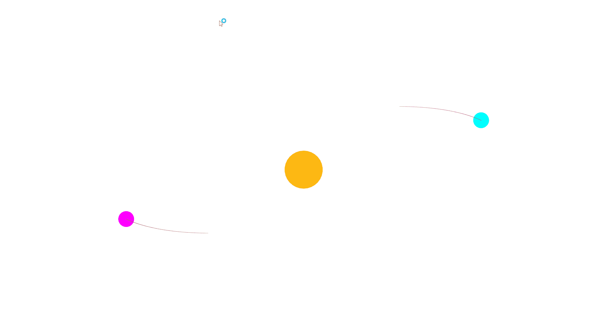

# Gravitational Attraction

Built with SFML, followed the book "The Nature Of Code - Daniel Shiffman".

By using vector math and Newton's law of universal gravitation, we can create a simulation of Gravitational Attraction, although not 100% accurate.

Project was made in 2/12/2022.
